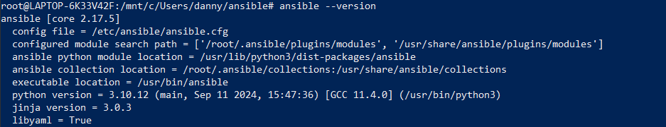
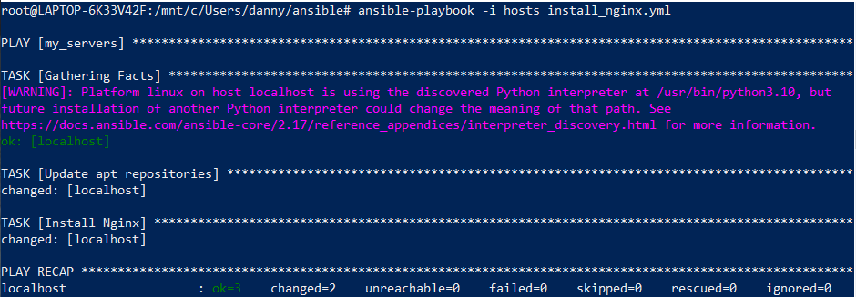
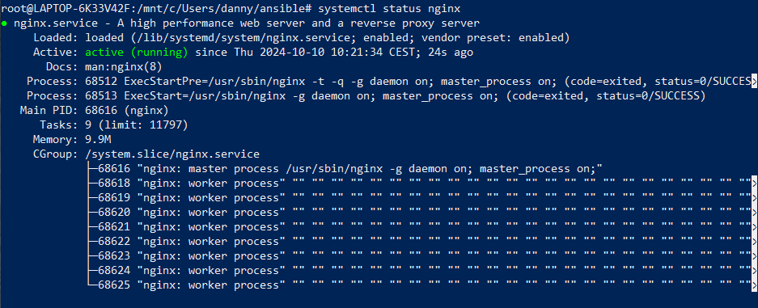

# Automatiseren met Ansible: De Sleutel tot Efficiëntie in IT Beheer

## Inleiding
Automatisering is een cruciaal onderdeel van DevOps, en het is essentieel om processen makkelijk en snel te beheren. Ansible speelt hierin een belangrijke rol, omdat het een goede en toegankelijke tool is voor het automatiseren van infrastructuur. DevOps-teams zijn voortdurend op zoek naar manieren om handmatige taken te verminderen en consistentie te waarborgen. In deze blogpost ontdek je wat Ansible is, hoe het werkt en waarom het een essentieel hulpmiddel is voor iedereen die zich bezighoudt met DevOps-automatisering.

## Wat is Ansible?

Ansible is een automatiseringstool die wordt gebruikt voor configuratiebeheer, applicatie-implementatie en infrastructuurautomatisering. Het stelt gebruikers in staat om taken op afstand uit te voeren op meerdere servers zonder dat er extra software op die servers hoeft te worden geïnstalleerd, omdat Ansible een agentless-architectuur hanteert.

Ansible werkt met behulp van YAML configuratiebestanden, genaamd Playbooks. In deze bestanden word de gewenste toestand van de infrastructuur wordt beschreven. Door deze Playbooks uit te voeren, kan Ansible automatisch de benodigde configuraties, updates en installaties doorvoeren. Dit zorgt voor een gestroomlijnde en herhaalbare manier om systemen te beheren, wat tijd en moeite bespaart.

## Hoe werkt Ansible?
Als eerste installeer je Ansible met het command `sudo apt install ansible`. Zoals eerder genoemd is Ansible agentless, maar er is één systeem die de tasks naar de andere systemen stuurt. Op dat systeem is Ansible noodzakelijk, maar op de systemen waar je de tasks heen stuurt is dat niet het geval. Zodra Ansible is geïnstalleerd, voer je `ansible --version` uit om de versie van Ansible te controleren. Je krijgt dan een output die vergelijkbaar is met de afbeelding hieronder.

*Afbeelding 1: versiecontrole van Ansible*

Vervolgens geef je aan Ansible op naar welke systemen je wilt communiceren. Dit doe je door een hosts-bestand te maken, waarin je de DNS-namen of IP-adressen van de systemen plaatst. In het onderstaande voorbeeld wil ik alleen de lokale server aanspreken, dus gebruik ik de term local. Begin met een naam voor de groepering van de servers en beschrijf je daarna de servers die onder deze groep vallen.

*Afbeelding 2: voorbeeld van een hosts file*

Als laatste onderdeel van de voorbereiding stel je een playbook op dat je wilt uitvoeren. Een playbook wordt geschreven in een YML-bestand en hierin beschrijf je de tasks die op de andere apparaten uitgevoerd moeten worden.

Een playbook is opgebouwd uit verschillende onderdelen:
- **Hosts**: De groep of specifieke servers waarop de taken worden uitgevoerd.
- **Become**: Hiermee geef je aan dat je root-privileges wilt gebruiken voor de uitvoering van de taken.
- **Tasks**: Een lijst van acties die uitgevoerd moeten worden, waarbij elke taak een naam, de module en de parameters bevat.

Hieronder zie je een voorbeeld van een playbook waarin repo's worden geupdate en Nginx wordt geïnstalleerd:

*Afbeelding 3: voorbeeld van een playbook*

Nu voeg je alles samen en voer je het playbook uit op de apparaten in het hosts-bestand met het command `ansible-playbook -i hosts install_nginx.yml`. Hieronder zie je dat de tasks die je hebt gedefinieerd worden uitgevoerd en dat je een "OK"-status terugkrijgt.

*Afbeelding 4: uitvoeren van een playbook*

Om te controleren of alles correct heeft gewerkt, kijk je of Nginx is geïnstalleerd op het apparaat. Dit doe je door het command `systemctl status nginx` uit te voeren. Hieronder zie je de uitkomst.

*Afbeelding 5: check of nginx juist is geinstalleerd*

## Voor- en nadelen Ansible
### Voordelen
Nu we weten wat Ansible is en hoe het werkt, gaan we de voor- en nadelen van deze tool op een rij zetten. Dit helpt ons bij het maken van een keuze over het gebruik van Ansible in verschillende scenario's.

1. **Makkelijk te leren**: Ansible heeft een eenvoudige leercurve, waardoor het toegankelijk is voor zowel beginners als ervaren gebruikers. De duidelijkheid van de syntaxis maakt het eenvoudig om aan de slag te gaan.

2. **YAML-bestanden**: Ansible gebruikt YAML voor zijn configuratiebestanden, wat de leesbaarheid bevordert. Deze eenvoudige opmaak maakt het gemakkelijk om playbooks te begrijpen en aan te passen.

3. **Schaalbaarheid**: Ansible kan eenvoudig schalen van een paar servers tot duizenden, waardoor het een ideale oplossing is voor zowel kleine als grote infrastructuren.

4. **Agentless**: Ansible vereist geen agenten op de doelservers, wat de installatie en het beheer vereenvoudigt.

### Nadelen

1. **Niet optimaal voor Windows**: Ansible is voornamelijk geoptimaliseerd voor Linux- en Unix-omgevingen. Hoewel het ook met Windows-systemen kan werken, is de ondersteuning en functionaliteit minder.

2. **Geen UI**: Ansible biedt geen interface voor het beheren van taken en playbooks. Dit kan voor sommige gebruikers een nadeel zijn.

## Conclusie
Ansible is een krachtige tool die geschikt is voor DevOps-teams die hun infrastructuur op een eenvoudige, schaalbare manier willen beheren. Voor mensen die net beginnen met automatisering of geen uitgebreide programmeerkennis hebben, biedt Ansible een toegankelijke oplossing door het gebruik van YAML en de agentless architectuur. Dit maakt het ideaal voor omgevingen met Linux of Unix, en waar schaalbaarheid en eenvoud in beheer essentieel zijn.

Echter, als je voornamelijk werkt met Windows-systemen. Of als je de voorkeur geeft aan een UI om je configuraties te beheren, is Ansible mogelijk niet de beste keuze. De beperkte ondersteuning voor Windows en het ontbreken van een UI kunnen dan als beperkingen worden ervaren. In die gevallen zou het nuttig zijn om alternatieven te overwegen die beter aansluiten bij deze specifieke behoeften.

Kortom, Ansible is zeer bruikbaar voor omgevingen die de focus leggen op Linux/Unix en eenvoud in automatisering, maar minder geschikt voor complexe Windows-omgevingen of gebruikers die een voorkeur hebben voor een tool met een UI.

## Bronnen
Dhruv. (z.d.). GitHub - dhruv291101/Ansible-Pros-and-Cons. GitHub. https://github.com/dhruv291101/Ansible-Pros-and-Cons
Fireship. (2023, 28 maart). Ansible in 100 seconds [Video]. YouTube. https://www.youtube.com/watch?v=xRMPKQweySE
Homepage | Ansible Collaborative. (z.d.). https://www.ansible.com/
NetworkChuck. (2020, 7 mei). you need to learn Ansible RIGHT NOW!! (Linux Automation) [Video]. YouTube. https://www.youtube.com/watch?v=5hycyr-8EKs
The Pros and Cons of Ansible | UpGuard. (z.d.). https://www.upguard.com/blog/top-5-best-and-worst-attributes-of-ansible
